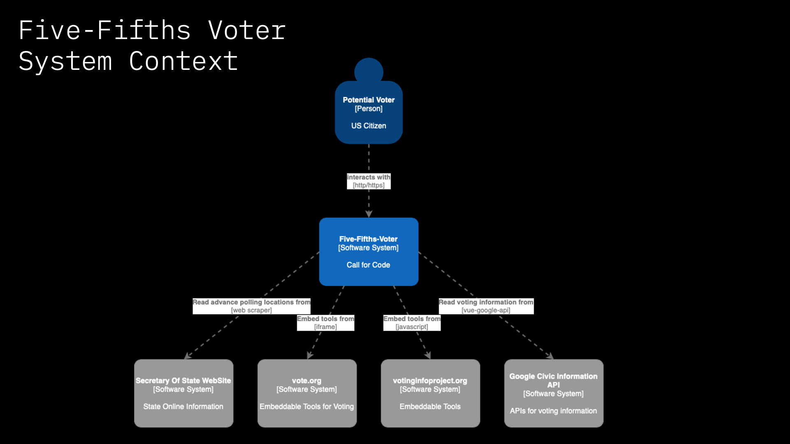

# Five Fifths Voters Starter Kit

This solution starter was created by technologists from IBM.

# Authors

* Alexandria Leggett 
* Andrea Lucas 
* Yolanda Rabun
* Denise Knorr 
* Evelyn R. Anderson 
* David Nixon 
* Syd Bailey 
* Sebastian Huynh 
* Alexandra Devine 
* Gerald Mitchell  
* Chris Stefano 
* Dylan Zucker 
* Kristen Ray
* Ricky Ellison 
* Ann Umberhocker 
* Mike Boone 
* Shrey Anand 

# What is the problem?

For centuries, voters in disparate communities, particularly Black voters, have experienced obstacles in casting their votes be it situational or intentionally constructed. Voting has been perceived an intangible and unfair process based on restrictive local processes, changing requirements, regulations, inability to access the correct voting location, and lack of information. As a result millions of minority votes go uncounted, purged, or simply not submitted do to lack of faith and trust in the system.

The **Five Fifths Voter** solution will help ensure that disenfranchised minority voters can are Educated, Empowered, and Enabled to overcome setbacks incurred by voter suppresion through achieving the follwoing; clearly identifying the correct polling station, notifying users of all requirements needed for their state and personal data as it pertains to different types of voting, deadlines, and quick/ affordable access. This solution helps to rewrite the narrative by placing control back in the voters' hands and generating a voter journey that prioritizes their individual lifestyles and needs. 

Furthermore, **Five Fifths Voter** strives to evolve the culture of voting and enable users to build a relationship with us through having the ability to select personalized features that enhance their experience and interact with other users to become a part of a community. This platform is designed to keep users coming back for many elections to come.

# Video

# Pitch

The Voting Rights Act of 1965 was enacted to prohibit racial discrimination in voting. Yet, history has shown the inequalities such as voter suppression have led to corruption and a weak democracy that does not reflect the will of the people. 

The IBM Call for Code for Policy & Legislation Reform has developed a solution to support the voter experience that focuses on addressing key areas of voter suppression such as voter registration, voter ID laws, voter registration restrictions, voter purging, felony disenfranchisement, and gerrymandering, all of which are contributors to disenfranchising minorities and people with disabilities. 

**Five Fifths Voter** is a cognitive solution designed to determine optimal voting strategies for each individual voter while limiting the impact of previous suppression issues.

# How it works
# Architecture

# Datasets
- [Google Civic Information API](https://developers.google.com/civic-information/)
- [Google Maps API](https://developers.google.com/maps/documentation)
- [Twitter API](https://developer.twitter.com/en/docs/twitter-api)
- [Vote.org Civic engagement tools](https://www.vote.org/technology/)
- [The Voting Information Project](https://www.votinginfoproject.org/)

# Technology
## IBM technology
- [Watson Tone Analyzer](https://www.ibm.com/watson/services/tone-analyzer/)
- [Watson Natural Language Understanding](https://www.ibm.com/cloud/watson-natural-language-understanding)
## Open source technology
- [VueJS](https://vuejs.org)
- [ExpressJS](https://expressjs.com)
- [Python](https://www.python.org)
- [Carbon](https://www.carbondesignsystem.com)

# For developers

See the [Getting Started](doc/GETSTARTED.md) document.

# Suggestions

See the [issues list](https://github.com/Call-for-Code-for-Racial-Justice/Five-Fifths-Voter/issues) for a full list of items that are currently being worked in the **Five Fifths Voter** project. Issues marked as ["top priority"](https://github.com/Call-for-Code-for-Racial-Justice/Five-Fifths-Voter/issues?q=is%3Aissue+is%3Aopen+label%3A%22top+priority%22) must be considered first.

# Solution Summary

For details, see [Solution Fortification](doc/SolutionFortification.md).

