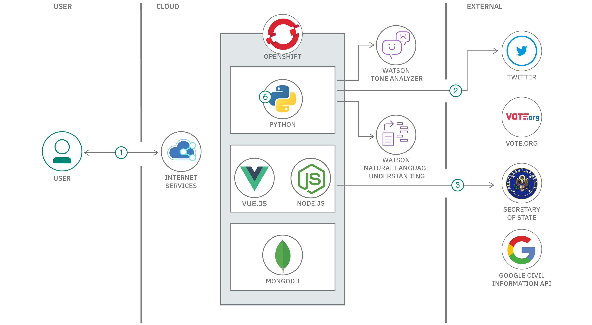

  

# Five Fifths Voter Solution Starter

This solution starter was created by technologists from IBM.

# Authors

- **Alexandria Leggett** _Product Offering Manager & Creative Director_
- **Andrea Lucas** _Product Offering Manager & Technical Director_
- **Yolanda Rabun** _Lead Generalist_
- **Denise Knorr** _Operations Director_
- **Evelyn R. Anderson** _Sr. Security & IP Advisor_
- **Sebastian Huynh** _Lead Designer_
- **David Nixon** _Developer_
- **Gerald Mitchell** _Developer_
- **Syd Bailey** _Developer_
- **Ann Umberhocker** _Developer_
- **Shrey Anand** _Developer_
- **Alexandra Devine** _Designer & IP Strategist_
- **Dylan Zucker** _Data Scientist_
- **Kristen Ray** _Data Scientist_
- **Chris Stefano** _Generalist_
- **Ricky Ellison** _Generalist_
- **Mike Boone** _Sr. Security & IP Advisor_

# What is the problem?

American History has shown that voter suppression has led to corruption and a weak democracy that does not reflect the will of the people. Voting has been perceived an intangible and unfair process based on restrictive local processes, changing requirements, regulations, an inability to access the correct voting location, and a lack of information. As a result, millions of minorities, especially Black people, have had their votes go uncounted, purged, or simply not submitted due to lack of faith and trust in the system.

The [**Five Fifths Voter**](https://www.fivefifthsvoter.com) solution starter focuses on addressing the key areas of voter suppression such as voter registration, voter ID laws, voter registration restrictions, voter purging, felony disenfranchisement, and gerrymandering all of which are contributors to disenfranchising minorities and people with disabilities. The solution helps with these challenges by providing a capability to help ensure disenfranchised minority voters are educated, empowered, and enabled to overcome setbacks incurred by voter suppression. Five Fifths Voter helps to identify the correct polling stations, notifies users of requirements needed for their state, and personal circumstances as it pertains to different types of voting, deadlines, and quick access to information.

The solution starter is provided as a web-based application that’s hosted on IBM Cloud and is available for both desktop and mobile browsers.

# Video

# Pitch

The Voting Rights Act of 1965 was enacted to prohibit racial discrimination in voting. Yet, history has shown the inequalities such as voter suppression have led to corruption and a weak democracy that does not reflect the will of the people.

The IBM Call for Code for Policy & Legislation Reform has developed a solution to support the voter experience that focuses on addressing key areas of voter suppression such as voter registration, voter ID laws, voter registration restrictions, voter purging, felony disenfranchisement, and gerrymandering, all of which are contributors to disenfranchising minorities and people with disabilities.

[**Five Fifths Voter**](https://www.fivefifthsvoter.com) is a cognitive solution designed to determine optimal voting strategies for each individual voter while limiting the impact of previous suppression issues.

# How it works

# Architecture

# Datasets

- [Google Civic Information API](https://developers.google.com/civic-information/)
- [Google Maps API](https://developers.google.com/maps/documentation)
- [Vote.org Civic engagement tools](https://www.vote.org/technology/)
- [The Voting Information Project](https://www.votinginfoproject.org/)
- [Vote 411 Election Information](https://www.vote411.org/)

# Technology

## IBM technology

- [IBM Code Engine](https://www.ibm.com/products/code-engine)

## Open source technology

- [Nuxt](https://nuxt.com/)
- [Carbon](https://www.carbondesignsystem.com)
- [Tailwind](https://tailwindcss.com/)

# For developers

See the [Getting Started](doc/GETSTARTED.md) document.

See the [User Guide](doc/USERGUIDE.md) document.

Please read the [CONTRIBUTING guidelines](/CONTRIBUTING.md)

# Suggestions

See the [issues list](https://github.com/Call-for-Code-for-Racial-Justice/Five-Fifths-Voter/issues) for a full list of items that are currently being worked in the **Five Fifths Voter** project. Issues marked as ["top priority"](https://github.com/Call-for-Code-for-Racial-Justice/Five-Fifths-Voter/issues?q=is%3Aissue+is%3Aopen+label%3A%22top+priority%22) must be considered first.

# Solution Summary

For details, see [Five Fifths Technology Summary](doc/SolutionFortification.md).

# Image credits

- democrat by Yi Chen from [Noun Project](https://thenounproject.com/browse/icons/term/democrat/)
- Republican by Yi Chen from [Noun Project](https://thenounproject.com/browse/icons/term/republican/)
- Porcupine by Loritas Medina from [Noun Project](https://thenounproject.com/browse/icons/term/porcupine/)
