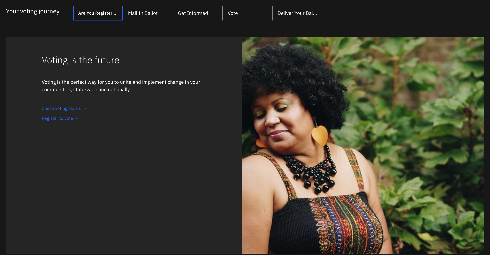
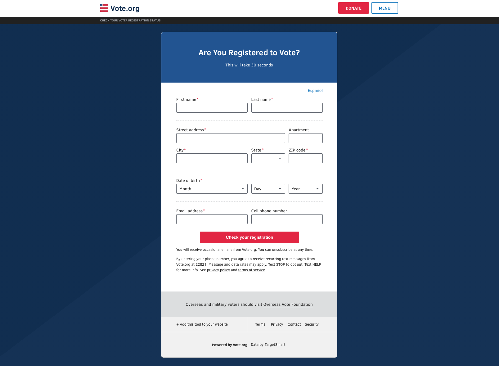
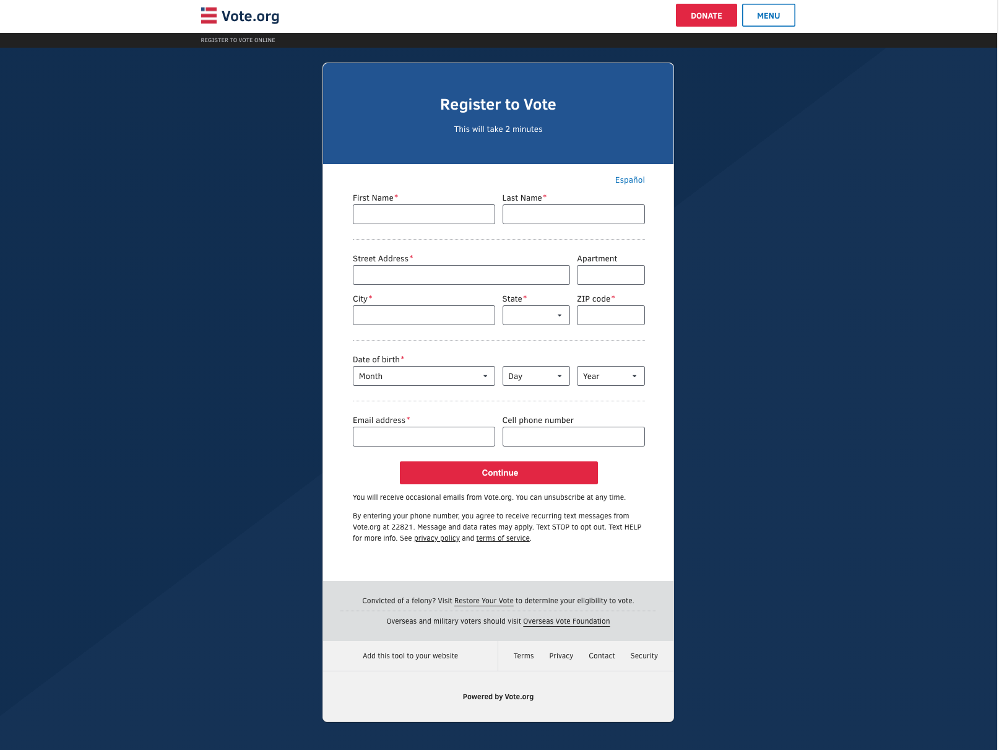
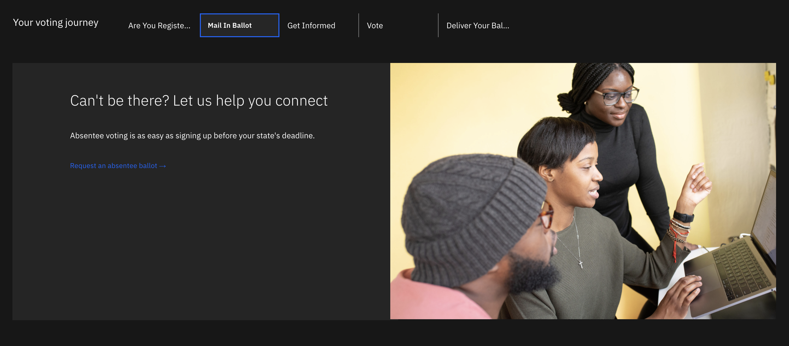
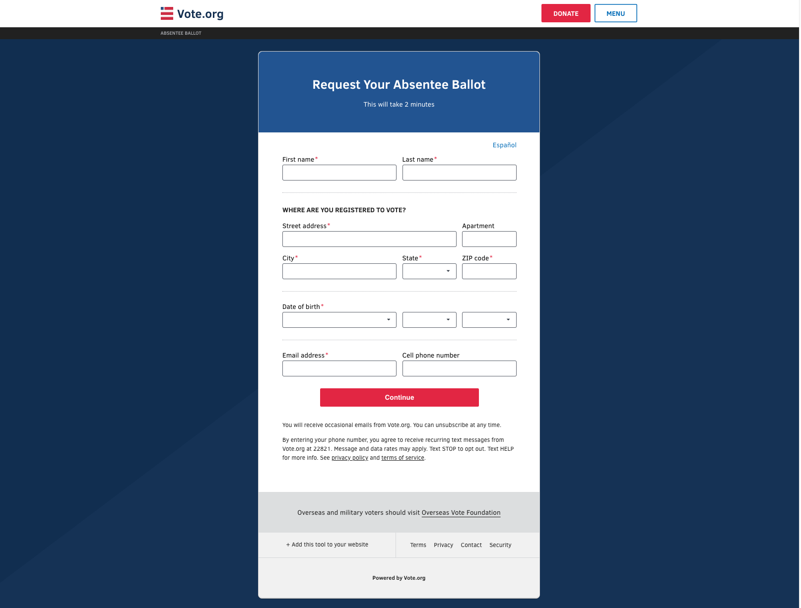
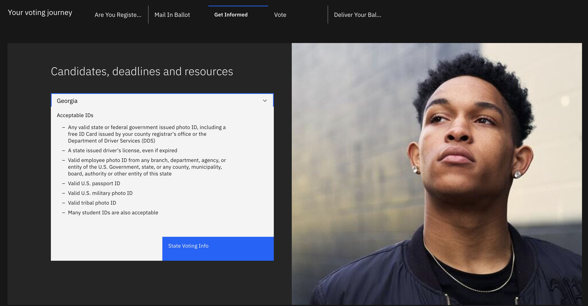
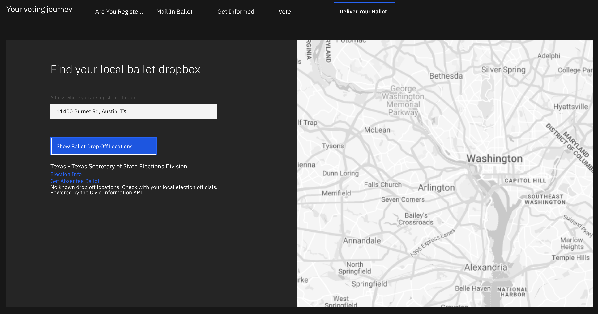
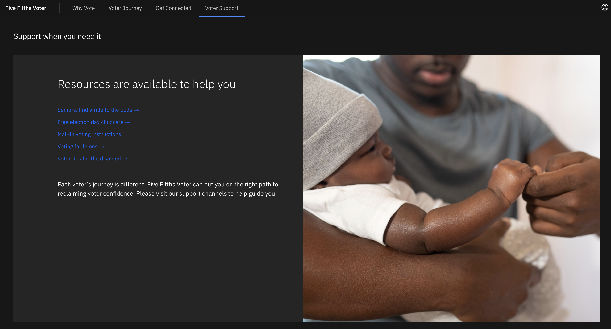

# **Five Fifths Voter How-To Guide**

# Contents

- [Introduction](#introduction) 

  - [Why Vote](#why-vote)

- [Application Content](#application-content) 

  - [Voter Journey](#voter-journey)

    - [Are You Registered](#are-you-registered)

    - [Mail In Ballot](#mail-in-ballot)

    - [Get Informed](#get-informed)

    - [Vote](#vote)

  - [Deliver Your Ballot](#deliver-your-ballot)

  - [Voter Support](#voter-support)

# Introduction

## Why Vote

**Why Your Vote Matters**

If you think just one vote in a sea of millions won&#39;t make much of a difference, then consider changing that thinking. Your single vote does matter!

Your commitment to having YOUR voice heard matters, especially if you are part of a community of voters who have historically had their voting rights challenged and marginalized.

It is because of these challenges that voting is a journey not just a single act on a single day.

So WELCOME to &quot; **Five Fifths Voter**&quot; where you can easily, safely and securely Get Connected and Get Support to succeed at making your voice and your vote matter.

# Application Content

The Five Fifths solution starter application is located at: https://www.fivefifthsvoter.com

## Voter Journey

The **Voter Journey** page is where you begin your journey to vote in an election. On this page you can:

- Obtain information about voter status
- Register to vote
- See what your state&#39;s options are for where, when and how you can cast your vote.

### Are You Registered

#### Check Voting Status

Use the &quot;**Check Voting Status**&quot; link to leverage verified and secure [vote.org](https://www.vote.org/) resources to check your voter registration status. Just complete all required fields (shown with a red **\*** ) and click submit to receive your current and verified registration status information.

#### Register

If you need to register, simply click the &quot;**Register to Vote**&quot; link to be directed to [vote.org](https://www.vote.org/) to fill out form that only takes 2 MINUTES! Complete all required fields (shown with a red **\*** ) and click submit to confirm you are successfully registered.

### Mail In Ballot

Click the &quot;**Request an absentee ballot**&quot; link to open a tab to allow users to register for a mail-in ballot on [vote.org](https://www.vote.org/). This provides a way to avoid reporting to polling locations to cast a vote. Complete all fields on the page with a red \* and click submit to receive a mail-in ballot.

### Get Informed

The **Get Informed** page provides users with useful information about their state&#39;s polling locations, and voter guidelines. From the drop-down menu select a state of your choice. After selecting the state, users can select &quot; **State Voting Info**&quot;. This will open a tab to the website [vote411.org](https://www.vote411.org/) where users can obtain all information on voting pertaining to their state.

### Vote

The **Vote** page allows users to locate early voting locations and/or their polling location on election day. Users will input their address into the field provided. Clicking on &quot;Early Voting&quot; users will be provided with a list of locations where they can cast their vote early. Clicking on &quot;Polling Location&quot; will provide users the location to their assigned polling place.

### Deliver Your Ballot

The **Deliver Your Ballot** page allows users to locate places to drop off their mail-in ballot. Users will input their address in the field provided. A list of local ballot drop boxes will be provided, allowing users to obtain directions via Google Maps to the ballot drop off location.

## Voter Support

The **Voter Support** page allows users to access resources that they need in order to cast their vote. Clicking on the available links will redirect users to a page that will provide them with the information needed to support them to cast their cast.

