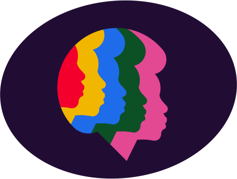

# Logos
| use                       | image                                     |
|---------------------------|-------------------------------------------|
| on dark/black background  |  |
| on white/light background |  |
| Old logo prior to 2024    |  |

# Silhouettes

# Social images

- Used in [URL unfurling](https://medium.com/slack-developer-blog/everything-you-ever-wanted-to-know-about-unfurling-but-were-afraid-to-ask-or-how-to-make-your-e64b4bb9254) 

# Color palette

| color        | HTML color code | swatch                              |
|--------------|-----------------|-------------------------------------|
| Black        | #0A0410         |         |
| White        | #FFFFFF         |         |
| Dark         | #210D34         |          |
| Off-white    | #FFEBD9         |     |
| Saffron      | #E8B933         |        |
| Orange       | #E66C31         |         |
| Popoy        | #E02E38         |          |
| Salmon       | #EC9899         |         |
| Mulberry     | #D35492         |       |
| Plum         | #85276E         |           |
| Verdigis     | #56B5B5         |       |
| Royal Blue   | #366AE2         |     |
| Yellow Green | #AFCB61         |  |
| Fern Green   | #397F42         |    |
| Cal Green    | #24502A         |     |
